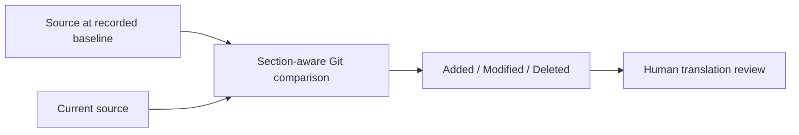

<div align="center">


<p>
  
  
  
  
  <a href="LICENSE"></a>
</p>

<p><strong>A planned CLI for finding source-document changes that require translation review.</strong></p>

<p>English · <a href="README.zh-TW.md">繁體中文</a> · <a href="docs/PRD.md">Product requirements</a></p>

</div>

PolyglotGuard is being designed for repositories that maintain one Markdown source
document and one or more translations. It will compare the source at a recorded
synchronization baseline with the current source, then report added, modified, and
deleted sections.

> [!IMPORTANT]
> **This repository is in the design phase.** It contains a product requirements
> document, not an installable CLI. Commands and output below describe the v0.1 target.

## The problem

Translated documentation often falls behind while the source keeps changing. Ordinary
line diffs do not help much because the files are written in different languages.
Maintainers need to know which *source sections* changed after each translation was
last reviewed.

PolyglotGuard's design avoids comparing prose across languages. Instead, it compares
two revisions of the same source document:



## Planned v0.1 contract

The first release is intended to:

- map one source Markdown document to one or more translated documents;
- require an explicit, maintainer-verified source synchronization revision;
- parse the baseline and current source into deterministic heading trees;
- report added, modified, and deleted source sections for each translation;
- produce terminal output and stable exit codes for local use and CI;
- run without an AI provider or external network service;
- remain read-only: no document edits, commits, branches, issues, or pull requests.

The translated prose itself will not be parsed or scored in v0.1. A `STALE` result will
mean that the source changed after the recorded baseline and needs human review; it will
not claim that the translation is incorrect.

## Expected command

```console
polyglotguard check
```

The planned exit codes are:

| Code | Meaning |
| ---: | --- |
| `0` | Every configured translation is current relative to its baseline. |
| `1` | At least one translation requires review. |
| `2` | Configuration, repository, parsing, or runtime error. |

The configuration filename and serialization format are still open design decisions.
PolyglotGuard will not guess a missing synchronization baseline.

## Not planned for v0.1

- AI translation or translation-quality scoring;
- automatic edits or pull requests;
- glossary enforcement;
- hosted accounts, dashboards, or billing;
- non-Markdown document formats;
- application localization-key management.

## Design document

The [product requirements document](docs/PRD.md) defines the scope, safety properties,
acceptance criteria, initial validation fixture, and unresolved design questions. It is
the current source of truth until implementation begins.

## License

Apache License 2.0. See [LICENSE](LICENSE).
