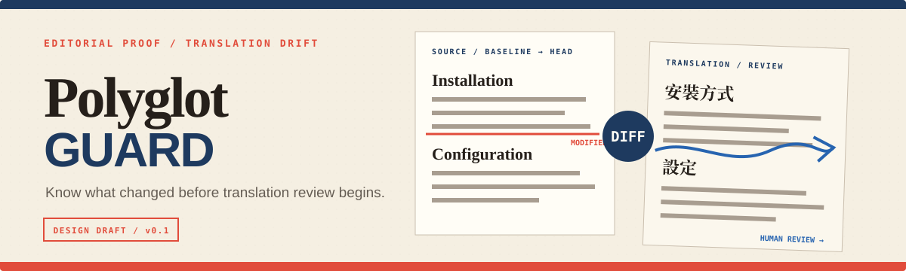
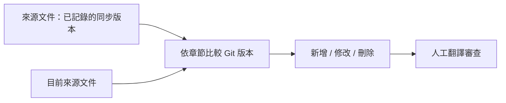

<div align="center">



<p>
  
  
  
  
  <a href="LICENSE"></a>
</p>

<p><strong>規劃中的 CLI：找出來源文件中需要重新檢查翻譯的變更。</strong></p>

<p><a href="README.md">English</a> · 繁體中文 · <a href="docs/PRD.md">產品需求文件</a></p>

</div>

PolyglotGuard 正在為多語 Markdown 文件的 repository 進行設計。它預計比較來源文件在
「上次同步版本」與目前版本之間的差異，再依章節回報新增、修改與刪除內容。

> [!IMPORTANT]
> **這個 repository 仍在設計階段。** 目前只有產品需求文件，尚未提供可安裝的 CLI。
> 下方指令與輸出規則描述的是 v0.1 目標，不是已完成的功能。

## 要解決的問題

來源文件持續更新時，翻譯版常會逐漸落後。因為兩份文件使用不同語言，一般逐行 diff
很難指出真正需要重新翻譯的範圍。維護者需要知道的是：每份翻譯上次確認後，來源文件的
哪些章節發生了變化。

PolyglotGuard 不直接比較不同語言的句子，而是比較同一份來源文件的兩個 Git 版本：



## 規劃中的 v0.1 契約

第一個版本預計：

- 將一份 Markdown 來源文件對應到一份或多份翻譯；
- 要求維護者明確記錄並確認來源文件的同步版本；
- 把基準版本與目前版本解析成穩定的標題樹；
- 針對每份翻譯回報來源章節的新增、修改與刪除；
- 提供終端輸出與穩定 exit code，供本機與 CI 使用；
- 不依賴 AI provider 或外部網路服務；
- 保持唯讀，不修改文件，也不建立 commit、branch、issue 或 pull request。

v0.1 不會解析或評分翻譯內容。`STALE` 只表示來源文件在同步版本之後發生變化，
需要人工檢查；它不代表 PolyglotGuard 已判定翻譯錯誤。

## 預計指令

```console
polyglotguard check
```

預計使用以下 exit code：

| Code | 意義 |
| ---: | --- |
| `0` | 所有已設定翻譯相對於同步版本都沒有新變更。 |
| `1` | 至少一份翻譯需要人工檢查。 |
| `2` | 設定、repository、解析或執行錯誤。 |

設定檔名稱與序列化格式仍是待決設計問題。PolyglotGuard 不會自行猜測缺少的同步版本。

## v0.1 不處理

- AI 翻譯或翻譯品質評分；
- 自動修改文件或建立 pull request；
- 術語表規則；
- 託管帳號、dashboard 或計費；
- Markdown 以外的文件格式；
- 應用程式 localization key 管理。

## 設計文件

[產品需求文件](docs/PRD.md)定義目前的範圍、安全屬性、驗收條件、初始驗證案例與
尚未決定的設計問題。在開始實作前，它是本專案的事實來源。

## 授權

Apache License 2.0，詳見 [LICENSE](LICENSE)。
