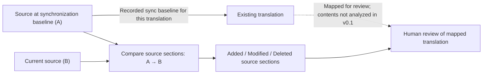

# PolyglotGuard Product Requirements Document

**Status:** Draft  
**Target release:** v0.1  
**Last updated:** 2026-08-12

## 1. Summary

PolyglotGuard is an open-source, developer-facing CLI that detects when translated Markdown documentation has drifted behind its source.

The first release focuses on detection, not repair. Given a source document, one or more translated documents, and the source revision at which each translation was last synchronized, PolyglotGuard reports which source sections have been added, modified, or deleted.

## 2. Background

Git-based documentation changes continuously. New features are documented, installation instructions are revised, sections are reorganized, and obsolete material is removed. Translated documentation is often created at a point in time and then updated inconsistently or not at all.

This creates translation drift:

- readers of different languages receive different information;
- maintainers cannot easily see what requires translation review;
- ordinary line diffs are noisy because the source and translation use different languages;
- layout and Markdown structure may diverge over time;
- ownership of ongoing translation maintenance is often unclear.

DeepTutor is the initial motivating case. Its English README evolves actively while multiple localized README files may reflect older structures and content. PolyglotGuard must be general-purpose and must not encode DeepTutor-specific rules.

## 3. Product Positioning

PolyglotGuard is a research-driven open-source developer tool.

It is not currently intended to be a SaaS product or commercial offering. Its immediate purpose is to solve a real maintenance problem, provide a reusable tool for open-source maintainers, and establish an evidence-based foundation for possible future integrations.

## 4. Product Principles

1. **Detect before repairing.** Maintainers need a trustworthy description of drift before any automated translation is attempted.
2. **Treat the source as authoritative.** Every translation is evaluated relative to an explicitly configured source document and synchronization baseline.
3. **Compare source history, not different languages.** Drift is determined by changes to the source since the translation was last synchronized. PolyglotGuard does not compare English prose directly with translated prose.
4. **Be structure-aware.** Markdown headings and section hierarchy are the primary units of change, rather than raw lines.
5. **Remain read-only.** No v0.1 command may modify documentation or create commits, branches, issues, or pull requests.
6. **Support humans and CI.** Reports must be understandable in a terminal and expose stable exit codes for automation.
7. **Prefer deterministic behavior.** The same repository state and configuration must produce the same result without a network service or AI model.

## 5. Target Users

### Primary user

An open-source maintainer whose repository contains a source Markdown document and one or more translated versions.

### Secondary users

- documentation contributors reviewing what needs translation;
- localization maintainers responsible for one language;
- engineering teams that want drift detection in continuous integration;
- researchers studying multilingual documentation maintenance.

## 6. Jobs to Be Done

A maintainer should be able to:

- declare which document is the source of truth;
- map that source to one or more translated documents;
- record the source revision at which each translation was last synchronized;
- run a single command from the repository;
- see whether each translation is current or stale;
- see exactly which source sections were added, modified, or deleted;
- use the command result in local workflows and continuous integration.

## 7. v0.1 Scope

### 7.1 Command-line workflow

The expected primary workflow is:

    polyglotguard check

The command runs from a local Git repository, reads the repository configuration, examines the relevant source history, and produces a report for every configured translation.

### 7.2 Configuration requirements

The exact file name and serialization format will be decided separately. The configuration must support:

- a repository-relative source Markdown path;
- one or more repository-relative translation paths;
- an optional locale identifier for each translation;
- a last-synchronized source Git revision for each translation;
- clear validation errors for missing files, invalid revisions, and malformed mappings.

The design must not assume that English is always the source language.

v0.1 supports one source group per configuration: one source Markdown document mapped to one or more translations. Multiple independent source groups in one configuration are out of scope for v0.1.

PolyglotGuard must not infer or guess a synchronization baseline. Maintainers must record a baseline they have verified. If no historical baseline can be established, a maintainer may record the current source revision as a new baseline. In that case, PolyglotGuard tracks later source changes but does not assess drift that occurred before the new baseline.

### 7.3 Markdown section model

PolyglotGuard must parse the baseline and current versions of the source Markdown document into deterministic hierarchical section trees.

At minimum:

- headings define section boundaries and parent-child relationships;
- heading-like text inside fenced code blocks is not treated as a document heading;
- section identity is based on its normalized heading path;
- section content boundaries are defined deterministically;
- document content before the first heading is represented consistently;
- repeated headings are handled deterministically.

Translation paths are used only to define mappings, verify that translated files exist, and identify affected translations in reports. v0.1 does not parse translated prose or compare source and translation structure.

The supported Markdown dialect and detailed identity rules will be finalized during parser design.

### 7.4 Change detection model

For each translation, PolyglotGuard compares the source document at the configured synchronization baseline with the current source document.

The diagram is explanatory; the prose in this section defines the v0.1 behavior.

Changes are classified as:

- **Added:** a section exists in the current source but not at the baseline;
- **Modified:** the same section exists at both revisions, but its source content changed;
- **Deleted:** a section existed at the baseline but no longer exists in the current source.

For v0.1, a heading rename or a move to a different heading path may be reported conservatively as one deletion and one addition unless a reliable identity rule is established.

PolyglotGuard does not attempt to judge whether translated prose is linguistically accurate or semantically equivalent.

### 7.5 Terminal report

A human-readable report must include:

- source path;
- translation path and locale when available;
- synchronization baseline;
- overall status: up to date, stale, or error;
- added, modified, and deleted sections grouped separately;
- total number of sections requiring translation review.

For a configured translation, `STALE` means that the source changed after the recorded synchronization baseline and that human translation review is required. It does not mean that PolyglotGuard has proven the existing translation incorrect. `UP TO DATE` means only that no reportable source change was found after the baseline; it does not validate translation completeness or quality.

Illustrative output:

    PolyglotGuard

    Source:
      README.md

    Translation:
      assets/README/README_TW.md

    Status: STALE

    Changes since last sync:

    Modified
      - Installation
      - Key Features

    Added
      - MCP Services

    Deleted
      - Legacy Setup

    4 sections require translation review.

Exact formatting may evolve, but the information and classifications must remain stable.

Machine-readable output, including JSON, is not required for v0.1. The first release requires the human-readable terminal report and exit codes defined in this document.

### 7.6 Exit codes

The CLI must expose predictable exit codes:

- **0:** all configured translations are up to date;
- **1:** at least one translation is stale;
- **2:** configuration, repository, parsing, or runtime error.

If a run contains both stale results and an error, exit code 2 takes precedence over exit code 1.

If the configured baseline cannot be resolved from local Git history—for example, because the repository is a shallow clone—the command must identify the unavailable revision, return exit code 2, and explain that the required history may be missing locally. It must not fetch history, change clone depth, or rewrite Git history automatically.

### 7.7 Safety and determinism

The check command must:

- perform no writes to tracked documentation;
- create no commits, branches, issues, or pull requests;
- require no AI provider or external network service;
- produce deterministic results for the same Git state and configuration;
- return actionable errors without destructive recovery behavior.

## 8. Non-Goals for v0.1

The following are explicitly outside the first release:

- AI translation;
- automatic editing of translated files;
- automatic pull request creation;
- translation quality scoring;
- terminology or glossary enforcement;
- full Markdown layout parity validation;
- a hosted service or SaaS product;
- dashboards, accounts, billing, or team permissions;
- non-Markdown document formats;
- generic application localization key management;
- commercialization.

These may be reconsidered only after drift detection works reliably on real repositories.

## 9. Motivating Validation Case

DeepTutor will be the first real-world fixture and dogfooding target.

The v0.1 fixture must provide:

- a pinned baseline source;
- a pinned current source;
- one or more mapped translation files;
- expected Added, Modified, and Deleted section paths.

Translation-structure and formatting divergence may be retained as research evidence for later phases, but they are not v0.1 acceptance criteria.

Any fixture derived from DeepTutor must be pinned to an upstream revision, record its provenance, comply with the upstream license and any applicable attribution requirements, and state whether it contains complete files, excerpts, or synthetic adaptations. The fixture must work offline and must not require modifying or accessing the live upstream repository. PolyglotGuard must not include DeepTutor-specific detector logic.

## 10. v0.1 Acceptance Criteria

v0.1 is acceptable when:

1. A repository can configure one source Markdown document mapped to one or more translations.
2. The CLI can resolve the configured synchronization baseline from local Git history.
3. The baseline and current versions of the source Markdown document are parsed into deterministic hierarchical section trees.
4. A test fixture containing added, modified, and deleted source sections is classified correctly.
5. The terminal report identifies the affected section paths and translation.
6. Exit codes distinguish current, stale, and error states.
7. The check command performs no repository writes.
8. Automated tests cover the parser, change classification, configuration errors, and CLI exit behavior.
9. The DeepTutor fixture demonstrates a useful drift report without DeepTutor-specific logic.
10. The same detector passes at least one independent fixture without repository-specific paths, conventions, or classification logic.

## 11. Success Signals

The initial release should demonstrate that:

- a maintainer can understand what needs translation review without manually comparing entire documents;
- the same detector works for DeepTutor and at least one independent fixture;
- the tool can run locally without an AI model or paid service;
- an open-source maintainer unfamiliar with the project can configure and run it from the documentation.

Stars, installations, external issues, and contributions are useful adoption signals, but correctness and usefulness on real repositories come first.

## 12. Initial Work Sequence

The initial work should remain deliberately small:

1. Research multilingual documentation drift patterns and existing approaches.
2. Define the repository configuration format and synchronization-baseline workflow.
3. Build a reproducible DeepTutor drift fixture.
4. Parse Markdown into a hierarchical section tree.
5. Detect added, modified, and deleted source sections.
6. Add terminal reporting, exit codes, and tests.
7. Dogfood the v0.1 CLI on the DeepTutor fixture.

Implementation work should begin only after the relevant issue includes context, constraints, and acceptance criteria.

## 13. Possible Future Directions

The following are possible later phases, not commitments for v0.1:

- GitHub Actions integration;
- Markdown structure, link, code-block, and HTML parity checks;
- glossary and terminology validation;
- an Agent Skill for guided maintenance;
- AI-assisted incremental translation;
- automatically prepared pull requests with mandatory human review;
- support for additional document formats.

## 14. Open Questions

The following decisions should be resolved through research or focused design issues:

- What configuration file name and format should be used?
- How should maintainers record and update the last-synchronized source revision?
- Which Markdown dialect and extensions must v0.1 support?
- How should renamed, moved, and duplicate headings be represented?
- Does the current source mean the version at `HEAD`, or may it include uncommitted working-tree changes?
- Must a synchronization baseline identify an immutable commit object, or may it use a movable Git reference?
- Does a section’s content include only its direct body or its full descendant subtree, and how should child-only changes affect parent classification?
