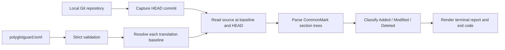

# PolyglotGuard v0.1 design

**Status:** Implemented

**Last updated:** 2026-08-12

This document fixes the behavioral decisions left open by the PRD. The tests are the
executable contract; this document explains the same boundaries for maintainers.

## Data flow



The command reads configuration, worktree translation paths, and committed source
blobs. It does not modify the repository or use the network.

## Configuration

The default configuration is `polyglotguard.toml` at the Git worktree root. Running
the command from a subdirectory does not change discovery. `--config` accepts one
explicit repository-relative alternative; configurations are never merged.

### Format selection

The three candidate formats were compared against the same criteria:

| Format | Maintainer comments | Typed, ordered mappings | Python 3.11 parser | Validation behavior | Editing cost for this schema |
| --- | --- | --- | --- | --- | --- |
| TOML | Supported | Integers, strings, and array-of-table order are explicit | Standard library | Syntax and duplicate keys fail during parsing; schema rules remain explicit | Compact and readable for repeated translation tables |
| YAML | Supported | Sequence order is explicit, but scalar typing depends on the selected schema and parser | Third-party dependency | Duplicate-key and implicit-scalar behavior must be configured | Compact, but indentation and parser policy add choices unrelated to v0.1 |
| JSON | Not supported | Numbers, strings, and array order are explicit | Standard library | Syntax and duplicate-key handling still need an explicit policy | Repeated mappings are clear but comments are unavailable and punctuation is heavier |

TOML was selected because it supports maintainer comments, typed values, and ordered
arrays of tables without adding a parser dependency. It is less verbose for this
hand-maintained schema than JSON and avoids selecting YAML scalar and duplicate-key
policies. The configuration stays separate from `pyproject.toml` because the checked
repository need not use Python.

```toml
version = 1
source = "README.md"

[[translations]]
path = "docs/README.zh-TW.md"
locale = "zh-TW"
baseline = "0123456789abcdef0123456789abcdef01234567"

[[translations]]
path = "docs/README.ja.md"
baseline = "89abcdef0123456789abcdef0123456789abcdef"
```

The v0.1 schema is strict:

- top-level keys are exactly `version`, `source`, and `translations`;
- `version` is the integer `1`, not a Boolean or string;
- one source maps to one or more translations in declaration order;
- each translation has a unique `path`, a full native-format commit object ID in
  `baseline`, and an optional opaque `locale` label;
- paths use canonical repository-relative POSIX syntax and end in `.md` or `.markdown`;
- absolute paths, backslashes, control characters, empty components, `.`, `..`, and
  drive-like paths are rejected;
- the source is a regular committed blob at `HEAD`;
- each translation is a regular, non-symlink worktree file inside the repository;
- each translation path matches the exact on-disk case and Unicode spelling;
- unknown and duplicate fields are errors rather than forward-compatible no-ops.

`locale` is a display label, not a validated BCP 47 identifier. When present, it must
be a non-empty string with no outer whitespace or Unicode General Category `Cc` or
`Cf` characters. PolyglotGuard does not normalize it or infer it from the translation
path.

The baseline lifecycle decisions are fully reflected in this schema: each mapping
stores its own full immutable commit ID, no field accepts a movable reference, and no
baseline is inferred. No configuration dependency on an unresolved lifecycle decision
remains.

### Invalid examples

These fragments are representative; each is rejected before any repository write:

```toml
# Movable or abbreviated revisions are not baselines.
baseline = "main"
```

```toml
# Paths cannot escape the worktree.
path = "../README.ja.md"
```

```toml
# The schema has no inferred language field.
language = "ja"
```

```toml
# A locale cannot contain a terminal control or format character.
locale = "zh\u000aTW"
```

### Validation and errors

All failures in this table produce exit code 2. Configuration-level failures stop the
run before mappings are checked. Translation-level failures produce an error result
for that mapping while the remaining mappings continue.

| Condition | Stable error | Scope and recovery |
| --- | --- | --- |
| Default or explicit configuration is missing or unreadable | `CONFIG_NOT_FOUND` or `CONFIG_UNREADABLE` | Run-level; create or make the file readable |
| TOML is malformed or repeats a key | `CONFIG_TOML` | Run-level; correct the TOML syntax |
| `version` is absent or not integer `1` | `CONFIG_VERSION` | Run-level; set `version = 1` |
| `translations` is absent, not an array of tables, or empty | `CONFIG_TRANSLATIONS` or `CONFIG_TRANSLATION` | Run-level; add at least one mapping table |
| A top-level or translation field is unknown | `CONFIG_UNKNOWN_FIELD` | Run-level; remove the field or correct its spelling |
| A source or translation path is empty, absolute, non-portable, escapes with `..`, or is not Markdown | `CONFIG_PATH` | Run-level; use a canonical repository-relative `.md` or `.markdown` path |
| A translation repeats another translation path, aliases the same physical file, or equals the source path | `CONFIG_MAPPING` | Make each mapping identify a distinct worktree file |
| A baseline is absent, abbreviated, movable, non-hexadecimal, or not 40/64 characters | `CONFIG_BASELINE` | Run-level; record a full verified commit ID |
| A lexically valid baseline has the wrong length for this repository's object format | `BASELINE_FORMAT` | Mapping-level; use 40 characters for SHA-1 or 64 for SHA-256 |
| A locale is empty, has outer whitespace, is not a string, or contains a `Cc`/`Cf` character | `CONFIG_LOCALE` | Run-level; use a trimmed opaque display label or omit it |
| The committed source or a worktree translation is missing | `FILE_MISSING` | Source failure is run-level; translation failure is limited to its mapping |
| An input is a symlink, directory, submodule, or resolves outside the repository | `FILE_NOT_REGULAR` or `FILE_OUTSIDE_REPOSITORY` | Use a regular file inside the worktree |
| A syntactically valid baseline is unavailable, not a commit, or not an ancestor of `HEAD` | `BASELINE_UNAVAILABLE`, `BASELINE_NOT_COMMIT`, or `BASELINE_NOT_ANCESTOR` | Mapping-level; correct the ID or make the verified history available locally |
| The source is absent or not regular at a baseline | `FILE_MISSING` or `FILE_NOT_REGULAR` | Mapping-level; choose a verified commit containing that source path |

PolyglotGuard reports these errors without changing the configuration, fetching Git
history, or attempting another recovery action.

## Synchronization baselines

One invocation resolves `HEAD^{commit}` once. That full object ID becomes the current
revision, and the current source is read from `<head>:<source>`. Staged, unstaged, and
untracked source content does not participate, so the same commit and configuration
produce the same result.

Every translation records a separate baseline. It must:

1. be a full hexadecimal object ID in the repository's storage format: 40 characters
   for SHA-1 or 64 for SHA-256;
2. exist in the local object database as a commit, not a tag, tree, or blob;
3. be equal to or an ancestor of the captured current revision; and
4. contain the configured source path as a regular blob.

Branch names, tags, `HEAD`, revision expressions, and abbreviated IDs are rejected.
Missing history produces an actionable error that names the unavailable revision.
PolyglotGuard does not fetch, deepen a shallow clone, or rewrite history.

### Lifecycle

| Scenario | Maintainer decision | `check` behavior and consequence |
| --- | --- | --- |
| New translation | Record the exact source commit reviewed while creating the translation | Later runs report source changes after that commit |
| Existing translation with known history | Select the last source commit for which a complete review can be verified | Commit timestamps and translation-only commits are not used as evidence |
| Existing translation with no reliable history | Explicitly bootstrap that mapping at the captured current source commit | Tracking starts there; the baseline preserves no information about earlier drift |
| Normal update | Review or update one translation against a specific source commit, then manually advance only its baseline to that commit | A newer unreviewed `HEAD` must not be recorded; other translations retain their own baselines |
| Several translations of one source | Record and advance each baseline independently | One invocation compares the same captured `HEAD` against every mapping-specific baseline |
| Dirty source worktree | Make no baseline decision based on staged, unstaged, or untracked source content | The worktree source is ignored; current content is the source blob at captured `HEAD` |
| Movable, abbreviated, or malformed revision | Replace it with a full 40- or 64-character verified commit ID | Configuration fails with `CONFIG_BASELINE` and exit code 2 |
| Commit is missing locally, including missing shallow-clone history | Make the required verified history available locally or correct the ID | That mapping reports `BASELINE_UNAVAILABLE`; exit code 2; no fetch or clone deepening occurs |
| Object is not a commit or is not an ancestor of current `HEAD` | Select a verified commit in the current branch history | That mapping reports `BASELINE_NOT_COMMIT` or `BASELINE_NOT_ANCESTOR`; exit code 2 |
| Source path is absent at the baseline | Select a verified commit that contains the configured source file | That mapping reports `FILE_MISSING`; exit code 2 |

The tool never derives a baseline from co-edits, timestamps, heading similarity, or
translated prose. `check` also never edits the configuration or advances a baseline.

## Markdown section model

The parser uses CommonMark block semantics and supports ATX headings at levels 1–6 and
Setext headings at levels 1–2. CommonMark fenced code rules apply, including unclosed
fences that extend to end of file. Heading-like lines inside a fence are content, and
raw HTML `<h1>` elements are not Markdown headings.

The document always contains a synthetic preamble section for content before the
first heading. A heading's parent is the nearest preceding open heading with a lower
level. Skipped levels do not create synthetic sections.

Heading labels are the parsed inline plain text:

- emphasis and link markup are removed while their text is kept;
- inline code and image alternative text are kept;
- entities are decoded and raw HTML tags are omitted;
- Unicode is normalized to NFC;
- Unicode whitespace is collapsed to one ASCII space and outer whitespace is removed;
- case and punctuation remain significant.

Each identity component contains the normalized label and a one-based occurrence
among equal sibling headings. Terminal paths quote each label as a JSON string and
join components with ` > `. Duplicate occurrences after the first append `[2]`, `[3]`,
and so on outside the quoted label. Quoting distinguishes a literal `A > B` heading
from the hierarchy `A` then `B`, and a literal `Foo [2]` from the second `Foo` sibling.
The full ancestor path is the section identity.

Sections contain only their direct body: the lines after their heading and before the
next recognized heading at any level. Descendant content does not belong to an
ancestor's body. This prevents a child-only change from also marking every ancestor as
modified.

Body comparison normalizes CRLF and CR line endings to LF and removes blank-only lines
at the outer boundaries of each direct body. All remaining Markdown is compared
exactly. In particular, trailing spaces are significant because CommonMark uses them
for hard line breaks.

NUL characters and non-UTF-8 source blobs are parsing errors.

## Change classification

- **Added:** a normalized section path exists only at the current revision.
- **Modified:** a path exists in both trees but its normalized direct body or heading
  level differs.
- **Deleted:** a path exists only at the baseline revision.

A rename or move changes the normalized path and is conservatively reported as a
deletion plus an addition. PolyglotGuard performs no fuzzy or semantic matching.

Results are ordered deterministically:

1. Added sections in current-document preorder;
2. Modified sections in current-document preorder;
3. Deleted sections in baseline-document preorder.

## Result and terminal contract

The language-independent internal model has these fields:

| Record | Fields |
| --- | --- |
| Run | Repository-relative source path, captured current commit ID, and translation results in configuration order |
| Translation | Repository-relative path, optional locale, configured baseline, resolved canonical baseline when available, status, ordered changes, and optional error |
| Change | `Added`, `Modified`, or `Deleted` plus one normalized source section path |
| Error | Stable code, message, and optional corrective hint |

The review count is derived from the number of changes; it is not an independently
stored value. A failed translation has status `ERROR`, no resolved baseline when
resolution failed, no changes, and one error record. A configuration,
repository-discovery, current-source read or parse, or unexpected runtime error ends
before a run result can be completed. A baseline-source read or parse error is limited
to the affected translation.

This in-memory shape supports the terminal renderer but is not a public JSON schema.
v0.1 has no serialized or machine-readable output contract.

Normal `UP TO DATE` and `STALE` blocks go to standard output. Translation errors and
fatal diagnostics go to standard error. Independent translation checks continue after
a per-translation error, so a run may contain successful and failed mappings. Entries
retain configuration order within each stream; callers must not infer relative order
between separately captured standard output and standard error.

`UP TO DATE` means only that no reportable source section changed after the baseline.
It does not validate translation completeness or quality. `STALE` means human review
is required; it does not prove that the existing translation is wrong.

Review counts are the number of disjoint Added, Modified, and Deleted paths per
translation. When a summary is shown, the total is summed across translations because
each mapping represents separate review work. The summary counts successful
`UP TO DATE` and `STALE` mappings; failed mappings remain in standard error.

Exit codes are derived after all possible mappings are checked:

| Run state | Standard output | Standard error | Exit code |
| --- | --- | --- | --- |
| Every mapping is `UP TO DATE` | All translation blocks and summary | Empty | 0 |
| At least one mapping is `STALE`, none failed | All current/stale blocks and summary | Empty | 1 |
| One or more mappings fail, none succeed | Empty | Error blocks | 2 |
| Successful or stale mappings plus one or more errors | Successful/stale blocks and summary | Error blocks | 2 |
| Fatal configuration, repository, current-source, parsing, or runtime failure | Empty | One fatal diagnostic | 2 |

Exit code 2 takes precedence over 1 in a mixed stale-and-error run.

### Illustrative output

The examples reflect the v0.1 renderer. Whitespace may evolve, but the paths,
baselines, statuses, classifications, counts, error context, stream placement, and
exit-code meanings are the stable terminal contract.

An up-to-date run writes this block to standard output, writes nothing to standard
error, and exits 0:

```text
PolyglotGuard

Source: README.md
Current revision: 0123456789abcdef0123456789abcdef01234567

Translation
  Path: docs/README.zh-TW.md
  Locale: zh-TW
  Baseline: 0123456789abcdef0123456789abcdef01234567
  Status: UP TO DATE
  No reportable source changes were found after this baseline.

Summary
  Checked translations: 1
  Stale translations: 0
  Section reviews: 0
```

A stale run writes its report to standard output, writes nothing to standard error,
and exits 1:

```text
PolyglotGuard

Source: README.md
Current revision: a5f5c8f52ec82fdbf53f8f608f87ae2d44ff21b8

Translation
  Path: docs/README.zh-TW.md
  Locale: zh-TW
  Baseline: 0123456789abcdef0123456789abcdef01234567
  Status: STALE
  Source changes after this baseline require human translation review.

  Added
    - "Installation" > "Package manager"

  Modified
    - "Installation"

  Deleted
    - "Legacy setup"

  3 sections require translation review.

Summary
  Checked translations: 1
  Stale translations: 1
  Section reviews: 3
```

If the only mapping has unavailable history, standard output is empty. Standard error
identifies the mapping and the missing revision, and the command exits 2:

```text
PolyglotGuard translation error

Source: README.md
Translation: docs/README.ja.md
Locale: ja
Configured baseline: ffffffffffffffffffffffffffffffffffffffff
Status: ERROR [BASELINE_UNAVAILABLE]
  Configured baseline is unavailable from local Git history: ffffffffffffffffffffffffffffffffffffffff
  Hint: Confirm the commit ID and ensure the required history exists locally. PolyglotGuard does not fetch or deepen a clone automatically.
```

In a mixed run, the successful or stale mappings still appear on standard output:

```text
PolyglotGuard

Source: README.md
Current revision: a5f5c8f52ec82fdbf53f8f608f87ae2d44ff21b8

Translation
  Path: docs/README.zh-TW.md
  Locale: zh-TW
  Baseline: 0123456789abcdef0123456789abcdef01234567
  Status: STALE
  Source changes after this baseline require human translation review.

  Modified
    - "Installation"
    - "Usage"

  2 sections require translation review.

Summary
  Checked translations: 1
  Stale translations: 1
  Section reviews: 2
```

The failed mapping from the same run appears on standard error:

```text
PolyglotGuard translation error

Source: README.md
Translation: docs/missing.md
Configured baseline: 0123456789abcdef0123456789abcdef01234567
Status: ERROR [FILE_MISSING]
  Configured translation does not exist in the worktree: docs/missing.md
```

Because the mixed run includes an error, it exits 2 even though another mapping is
stale.

## Safety properties

The production command requires Git 2.45 or later, uses read-only Git plumbing
commands, and disables optional locks, credential prompts, replacement objects, legacy
grafts, and lazy object fetching. It discards inherited `GIT_*` controls before setting
its own bounded environment. A partial clone with missing objects therefore fails
locally instead of contacting its promisor remote, and local replacement metadata
cannot change commit identity or ancestry. The command does not invoke `fetch`,
`checkout`, `reset`, `commit`, or another mutating command. It also performs no
documentation writes, network calls, AI requests, issue changes, or pull-request
operations.
